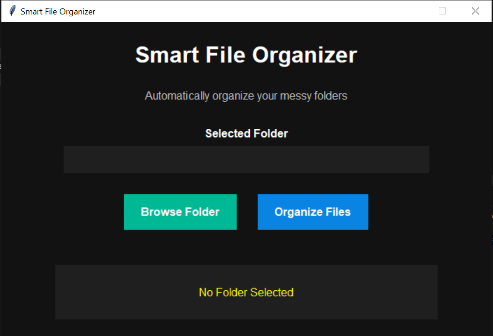

# Smart File Organizer

A clean and user-friendly Python desktop application built with Tkinter that organizes files inside a selected folder into categorized subfolders automatically.

## 🚀 Project Overview

Smart File Organizer helps you tidy up messy folders instantly. Select a directory, click **Organize Files**, and the app sorts files into category folders like **Images**, **Documents**, **Videos**, **Code**, and **Others**.

## ✨ Features

- Select any folder using a simple GUI
- Automatically move files into categories based on file extension
- Supported categories:
  - `Images` (.png, .jpg, .jpeg)
  - `Documents` (.pdf, .txt, .docx)
  - `Videos` (.mp4, .mkv)
  - `Code` (.py, .cpp, .java)
  - `Others` for uncategorized file types
- Status messages show the current state and number of files organized
- Minimalistic dark-themed interface

## 🛠 Technologies Used

- Python 3
- Tkinter (built-in Python GUI library)
- `os` and `shutil` for file operations

## ✅ Installation

1. Make sure Python 3 is installed on your system.
2. Clone or download this repository.
3. No external packages are required beyond the Python standard library.

```bash
git clone https://github.com/your-username/Smart-File-Organizer.git
cd "Smart-File-Organizer"
```

## ▶️ How to Run

From the project folder, run:

```bash
python main.py
```

Then:

1. Click **Browse Folder**.
2. Choose the folder you want to organize.
3. Click **Organize Files**.
4. The selected folder will be updated with category subfolders.

## 🖼 Screenshots

> Add a screenshot here to show the app interface.

### Main Application Window



## 🔮 Future Improvements

Ideas for next versions:

- Add support for more file categories and custom extensions
- Add preview of detected files before organizing
- Add undo functionality to restore moved files
- Make category rules configurable through the GUI
- Support nested folder scanning and recursive organization


For questions, feature ideas, or contributions, feel free to connect or open an issue.
## 👤 Maryam Javaid
[GitHub](github.com/maryam-javaid)
[Email](maryamjavaidbcs164@gmail.com)
